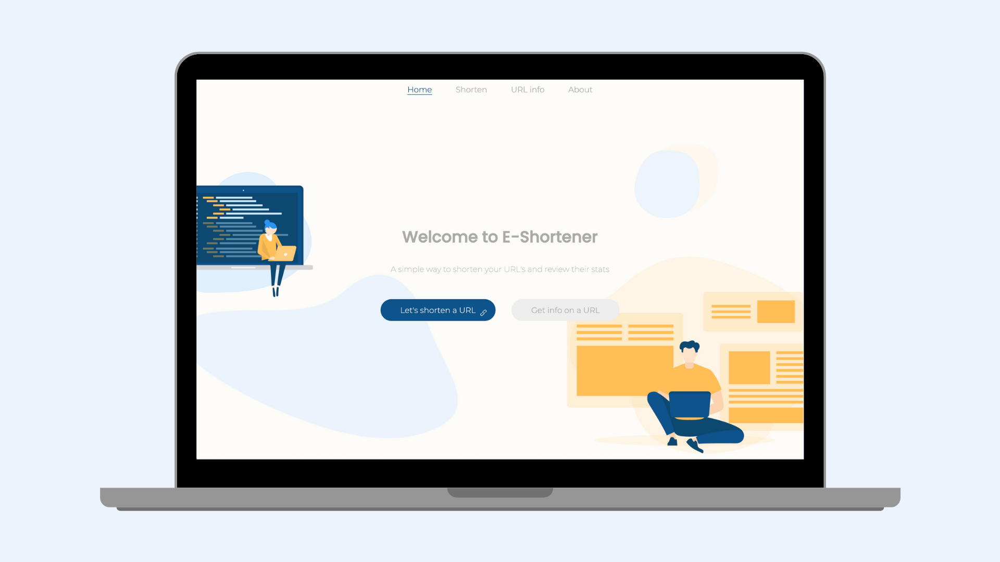
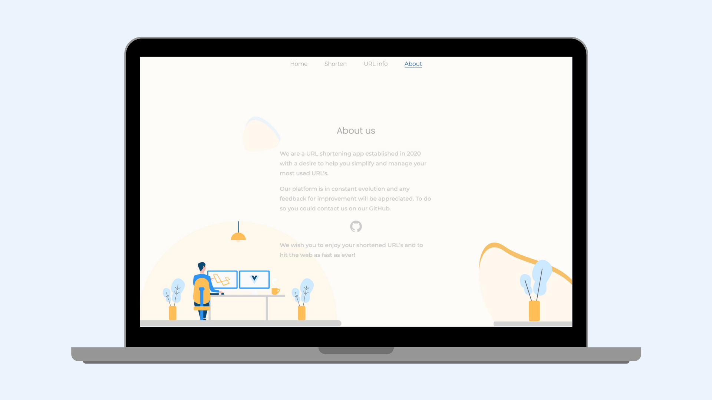
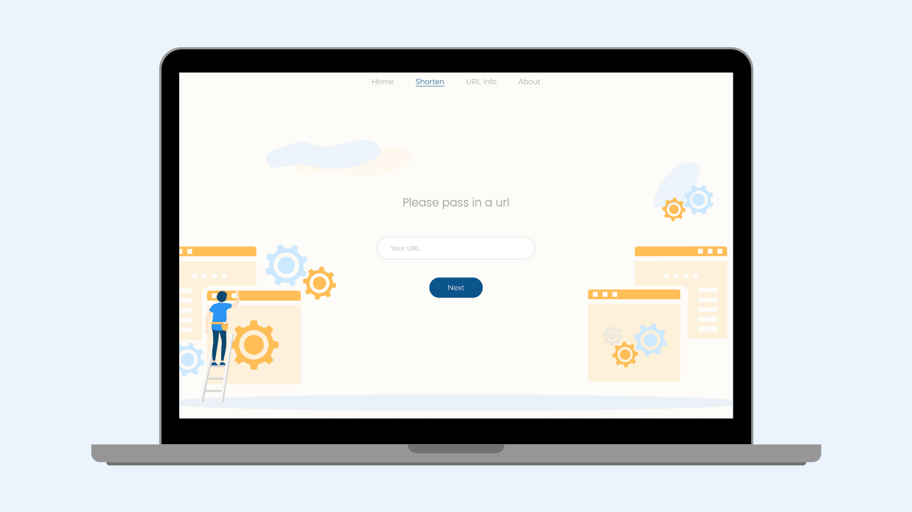
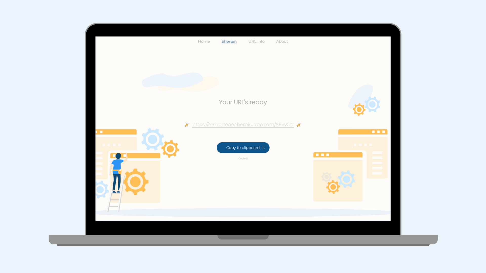
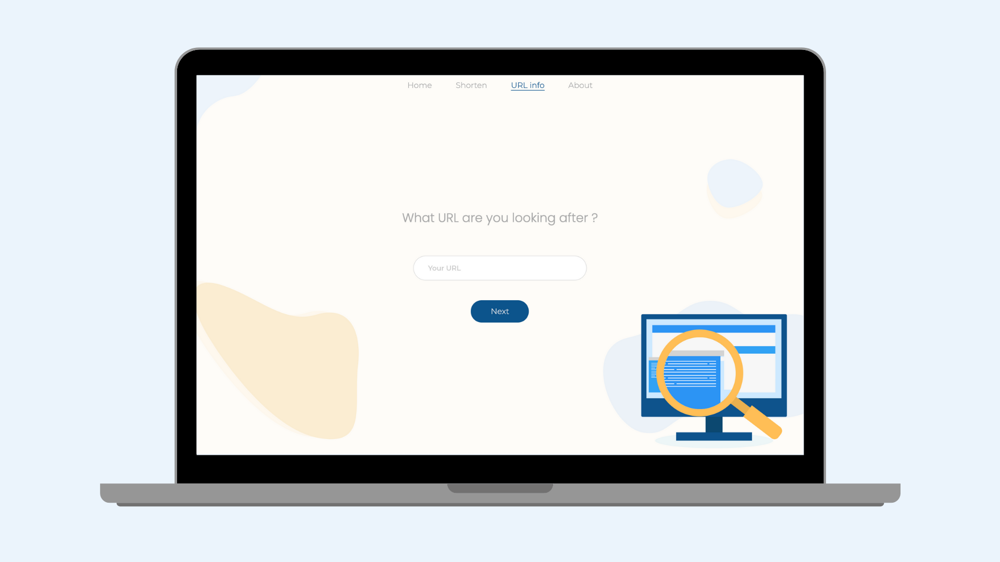
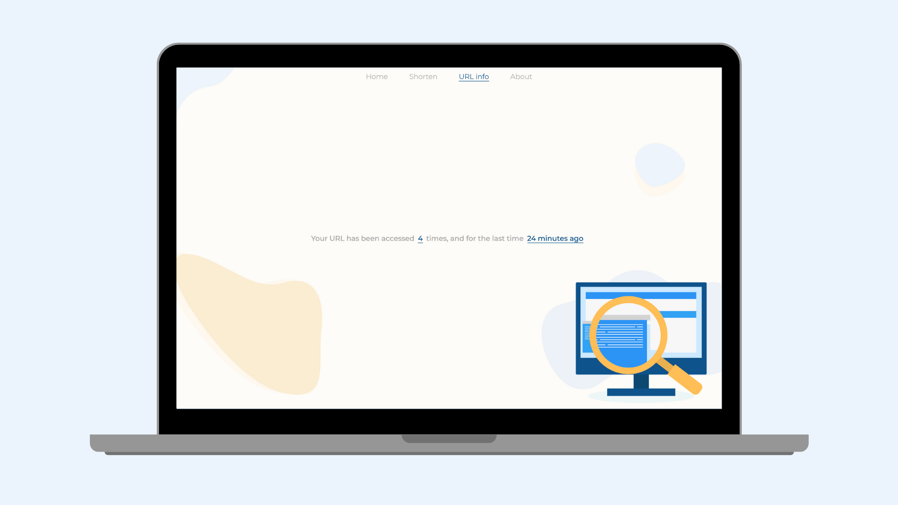

# E-shortener

`E-shorten` is a URL shortening app established in 2020 with a desire to help you simplify and manage your most used URL’s. 🏋️‍♂️
You can try it there 👇
- https://e-shortener.netlify.app/

## Getting-Started

Please follows this steps if you would like to start the project:

1) Clone the repo.
3) ```cd server && npm install```
3) In the server repository create a ```.env``` file with these variables
```
PORT=<PORT>
DB_PORT='mongodb://localhost:27017/<DB_NAME>'
BASE_URL='<BASE_URL>'
```
2) ```cd client && npm install```
3) In the client repository create a ```.env``` file with this variable 

```
REACT_APP_BASE_URL:<SERVER BASE URL>
```
4) Run   ``` npm start``` from the root repository.

  Et voilà! 🍷 You are all set !

## Screenshots

### Home page & About us

<div align="center">
  
  
</div>

### Shortening page

<div align="center">
  
  
</div>

### Stats page

<div align="center">
  
  
</div>


 ## Tech Stack
* [React](https://reactjs.org/)
* [MongoDB](https://www.mongodb.com/)
* [Mongoose](https://mongoosejs.com/)
* [Node.JS](https://nodejs.org/en/)
* [Express](https://expressjs.com/)
* [Styled-components](https://styled-components.com/)

## Todo

Some of the things to improve:

- Responsive design 📱
- Deploy with AWS 👨‍💻

### Author

- Charles-Thibault Verrier - [GitHub](https://github.com/chthve) [Linkedin](https://linkedin.com/in/chthve)

## License

MIT © [chthve](https://github.com/chthve)
